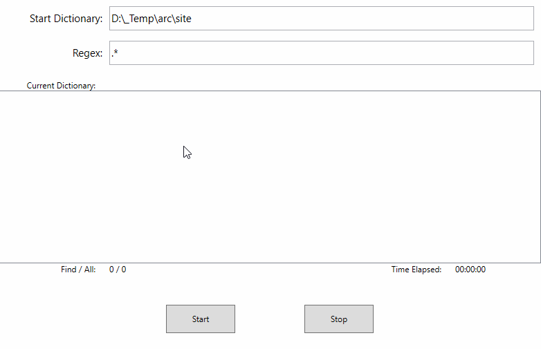

# Описание задачи.

Программа будет использоваться для поиска файлов на диске

Пользователь задает следующие критерии и они должны быть сохранены при перезапуске программы:

1. Стартовая директория (с которой начинается поиск)
2. Шаблон имени файла в виде regex выражения

При нажатии кнопки **Поиск** программа начинает отображать следующую информацию в режиме реального времени:

1. Все найденные по критериям файлы в виде дерева (как в левой части проводника).
2. Название директории, в которой идет текущий поиск.
3. Количество найденных и общее количество файлов.
4. Прошедшее от начала запуска поиска время.

При этом:  

+ Дерево не должно подвисать, моргать, тормозить и т.д.  
+ Во время поиска пользователь может ходить по дереву, открывать/закрывать узлы.  
+ Пользователь должен иметь возможность остановить поиск в любой момент и затем либо продолжить его либо начать новый поиск.

# Решение

